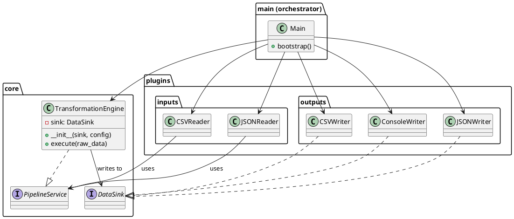

# Architecture Diagram

## PlantUML Diagram

The system's dependency structure is defined in `architecture.puml`:



## Visual Description

### Packages

- **main** – Orchestrator / Entry Point
- **core** – Business logic & protocol definitions
- **plugins.inputs** – Data source implementations
- **plugins.outputs** – Result persistence implementations

### Key Relationships

```
                    PipelineService (protocol)
                           ↑
                           |
                 ┌─────────┼─────────┐
                 |         |         |
            CSVReader  JSONReader  TransformationEngine
                                   (implements)
                                   
                           DataSink (protocol)
                                   ↑
                                   |
                 ┌─────────┬─────────┴──────────┐
                 |         |                    |
            ConsoleWriter JSONWriter      CSVWriter
                      (implement)
```

### Dependency Flow

**Inbound (Input):**
```
CSVReader ──→ PipelineService
JSONReader ──→ PipelineService
```

**Core:**
```
TransformationEngine
  ├─→ implements PipelineService
  └─→ depends on DataSink
```

**Outbound (Output):**
```
ConsoleWriter ──→ DataSink
JSONWriter ──→ DataSink
CSVWriter ──→ DataSink
```

**Orchestration:**
```
main
  ├─→ loads config.json
  ├─→ instantiates INPUT_DRIVERS[type]
  ├─→ instantiates OUTPUT_DRIVERS[type]
  ├─→ creates TransformationEngine(output_sink, config)
  ├─→ wires input → engine
  └─→ calls input.read()
```

## Direction of Dependencies

**Golden Rule:** Arrows point **toward** the core.

```
plugins.inputs  ──→  core  ←──  plugins.outputs
   (input)           (heart)        (output)
                      ↑
                   (direction
                    of control)
                      |
                    main (orchestrates)
```

No module depends on plugins. Plugins depend on core protocols only.

## Extensibility

To add a new component:

1. **New Input (e.g., YAMLReader)**
   - Depends on: `PipelineService` protocol only
   - Register: `main.INPUT_DRIVERS["yaml"] = YAMLReader`
   - Core is unchanged ✓

2. **New Output (e.g., DatabaseWriter)**
   - Implements: `DataSink` protocol
   - Register: `main.OUTPUT_DRIVERS["db"] = DatabaseWriter`
   - Core is unchanged ✓

---

See also: [Dependency Inversion Principle](../architecture/dependency_inversion.md)
